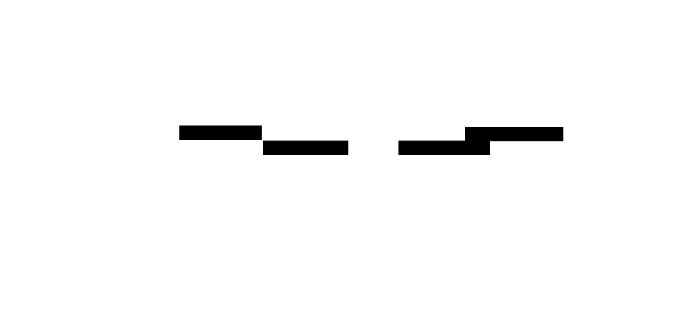
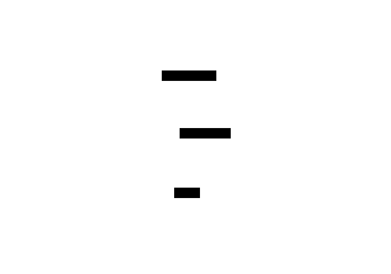

# Bases de Datos No Estructuradas — TI3032
> Guía de estudio: NoSQL, MongoDB, CRUD y búsqueda avanzada

---

## Mapa general del ramo


---

## Unidad 1 · Introducción a NoSQL

### ¿Por qué existe NoSQL?

Las bases de datos relacionales (SQL) guardan datos en **tablas con filas y columnas fijas**. Funcionan bien para datos estructurados, pero tienen problemas cuando:

- Los datos no tienen forma fija (redes sociales, logs, sensores)
- Se necesita escalar a millones de registros
- La estructura cambia frecuentemente durante el desarrollo

NoSQL ("Not Only SQL") nació para resolver esos casos.

---

### SQL vs NoSQL — comparación


| Concepto SQL | Equivalente MongoDB |
|---|---|
| Base de datos | Base de datos |
| Tabla | Colección |
| Fila | Documento |
| Columna | Campo |
| JOIN | Documento embebido / referencia |

---

### Tipos de bases de datos NoSQL




---

### Estructura de un documento MongoDB

Un **documento** es un objeto JSON/BSON. Cada documento vive dentro de una **colección**.

```json
{
  "_id": "ObjectId('64a1f2...')",
  "nombre": "Ana Torres",
  "edad": 28,
  "activo": true,
  "direccion": {
    "ciudad": "Santiago",
    "comuna": "Providencia"
  },
  "cursos": ["MongoDB", "Python", "Docker"]
}
```


---

## Unidad 2 · Operaciones CRUD con MongoDB

### Jerarquía de MongoDB


---

### Comandos de gestión

```js
// Bases de datos
show dbs
use tienda
db.dropDatabase()

// Colecciones
show collections
db.createCollection("productos")
db.productos.drop()
```

---

### CRUD — flujo completo


**Create:**
```js
db.productos.insertOne({ nombre: "Teclado", precio: 25000, stock: 10 })

db.productos.insertMany([
  { nombre: "Mouse", precio: 12000 },
  { nombre: "Monitor", precio: 150000 }
])
```

**Read:**
```js
db.productos.find()
db.productos.find({ precio: { $lt: 30000 } })
db.productos.findOne({ nombre: "Mouse" })
```

**Update:**
```js
db.productos.updateOne(
  { nombre: "Mouse" },
  { $set: { precio: 13000 } }
)
db.productos.updateMany(
  { stock: { $lt: 5 } },
  { $set: { activo: false } }
)
```

**Delete:**
```js
db.productos.deleteOne({ nombre: "Monitor" })
db.productos.deleteMany({ activo: false })
```

---

### Subdocumentos y arreglos




**CRUD en subdocumentos:**
```js
// Agregar al arreglo
db.clientes.updateOne(
  { nombre: "Ana" },
  { $push: { pedidos: { id: 3, total: 45000 } } }
)

// Eliminar del arreglo
db.clientes.updateOne(
  { nombre: "Ana" },
  { $pull: { pedidos: { id: 3 } } }
)

// Buscar por campo de subdocumento
db.clientes.find({ "direccion.ciudad": "Santiago" })
```

---

## Unidad 3 · Búsqueda Avanzada

### Operadores de filtro


**Ejemplos:**
```js
// Comparación
db.productos.find({ precio: { $gte: 10000, $lte: 50000 } })

// Lógico
db.productos.find({
  $or: [{ precio: { $lt: 5000 } }, { stock: { $gt: 100 } }]
})

// Arreglo
db.usuarios.find({ cursos: { $in: ["MongoDB", "Python"] } })
```

---

### Expresiones regulares

```js
// Empieza con "A"
db.clientes.find({ nombre: { $regex: /^A/ } })

// Contiene "mongo" (sin distinguir mayúsculas)
db.clientes.find({ nombre: { $regex: /mongo/i } })

// Termina en ".cl"
db.clientes.find({ email: { $regex: /\.cl$/ } })
```

---

### Búsqueda con Python (PyMongo)


```python
from pymongo import MongoClient

client = MongoClient("mongodb://localhost:27017/")
db = client["tienda"]
col = db["clientes"]

# Buscar por subdocumento
for doc in col.find({ "direccion.ciudad": "Santiago" }):
    print(doc["nombre"])

# Buscar con elemMatch en arreglo
col.find({
    "pedidos": { "$elemMatch": { "total": { "$gt": 30000 } } }
})
```

---

## Unidad 4 · Proyecto Integrador


---

## Resumen CRUD


---

*Documentación oficial: [docs.mongodb.com](https://docs.mongodb.com) · [pymongo.readthedocs.io](https://pymongo.readthedocs.io)*
