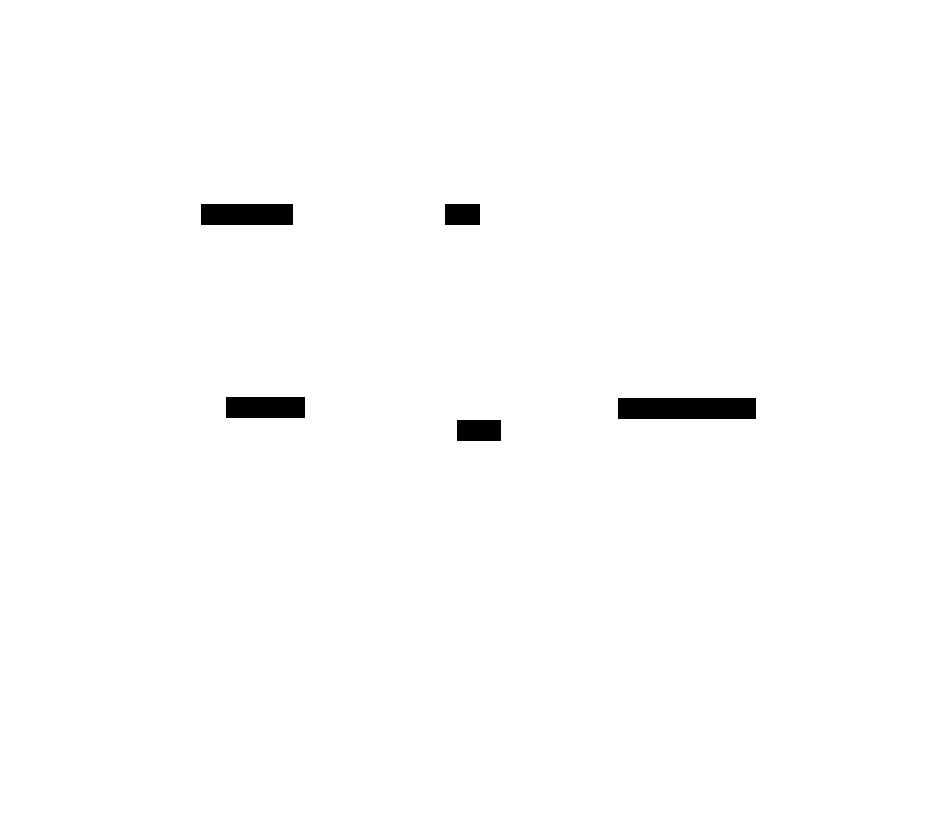

# Cálculo Diferencial — CBCD01
> Guía de estudio con fundamentos, conceptos y problemas reales

---

## Mapa general del ramo

---

## Unidad 1 · Límites y Continuidad

### ¿Qué es un límite?

Un **límite** describe el comportamiento de una función $f(x)$ cuando $x$ se **acerca** a un valor $a$, sin necesariamente llegar a él.

$$\lim_{x \to a} f(x) = L$$

> "A medida que $x$ se aproxima a $a$, la función $f(x)$ se aproxima a $L$."

---

### Límites laterales

| Notación | Significado |
|---|---|
| $\lim_{x \to a^-} f(x)$ | $x$ se acerca a $a$ por la **izquierda** |
| $\lim_{x \to a^+} f(x)$ | $x$ se acerca a $a$ por la **derecha** |

> El límite existe **si y solo si** ambos límites laterales son iguales:
> $$\lim_{x \to a^-} f(x) = \lim_{x \to a^+} f(x) = L$$

---

### Propiedades de los límites

Sea $\lim_{x \to a} f(x) = L$ y $\lim_{x \to a} g(x) = M$:

$$\lim_{x \to a} [f(x) + g(x)] = L + M$$
$$\lim_{x \to a} [f(x) \cdot g(x)] = L \cdot M$$
$$\lim_{x \to a} \frac{f(x)}{g(x)} = \frac{L}{M}, \quad M \neq 0$$
$$\lim_{x \to a} [f(x)]^n = L^n$$

---

### Formas indeterminadas — flujo de resolución

**Ejemplo — factorización:**

$$\lim_{x \to 2} \frac{x^2 - 4}{x - 2} = \lim_{x \to 2} \frac{(x-2)(x+2)}{x-2} = \lim_{x \to 2} (x+2) = 4$$

**Regla de L'Hôpital:**

$$\lim_{x \to a} \frac{f(x)}{g(x)} = \lim_{x \to a} \frac{f'(x)}{g'(x)}$$

---

### Continuidad — las tres condiciones

---

### Problema real — Límites

> Una empresa modela sus costos con $C(x) = \frac{x^2 - 9}{x - 3}$. ¿Cuál es el costo cuando $x \to 3$?

$$\lim_{x \to 3} \frac{x^2 - 9}{x - 3} = \lim_{x \to 3}(x+3) = 6$$

El costo se aproxima a **6 mil pesos** por unidad.

---

## Unidad 2 · Derivadas

### ¿Qué es una derivada?

La **derivada** mide la **tasa de cambio instantánea** de una función. Geométricamente, es la pendiente de la recta tangente en un punto.

$$f'(x) = \lim_{h \to 0} \frac{f(x+h) - f(x)}{h}$$

---

### Notaciones equivalentes

$$f'(x) = \frac{dy}{dx} = \frac{d}{dx}[f(x)] = \dot{y}$$

---

### Reglas de derivación

| Regla | Fórmula |
|---|---|
| Constante | $\frac{d}{dx}[c] = 0$ |
| Potencia | $\frac{d}{dx}[x^n] = n \cdot x^{n-1}$ |
| Suma/Resta | $\frac{d}{dx}[f \pm g] = f' \pm g'$ |
| Producto | $\frac{d}{dx}[f \cdot g] = f'g + fg'$ |
| Cociente | $\frac{d}{dx}\left[\frac{f}{g}\right] = \frac{f'g - fg'}{g^2}$ |
| Cadena | $\frac{d}{dx}[f(g(x))] = f'(g(x)) \cdot g'(x)$ |

---

### Regla de la cadena — cómo aplicarla

---

### Derivadas de funciones comunes

$$\frac{d}{dx}[\sin x] = \cos x \qquad \frac{d}{dx}[\cos x] = -\sin x$$

$$\frac{d}{dx}[e^x] = e^x \qquad \frac{d}{dx}[\ln x] = \frac{1}{x}$$

$$\frac{d}{dx}[\tan x] = \sec^2 x$$

---

### Problema real — Derivadas

> Un proyectil sigue $h(t) = -5t^2 + 20t + 3$ metros. ¿Cuál es su velocidad en $t = 2$ s?

$$h'(t) = -10t + 20 \implies h'(2) = 0 \text{ m/s}$$

En $t = 2$ el proyectil está en su **punto más alto**.

---

## Unidad 3 · Aplicaciones de las Derivadas

### Análisis completo de una función

---

### Optimización — Procedimiento

---

### Problema real — Optimización

> Caja sin tapa, base cuadrada, $V = 32$ m³. ¿Dimensiones que minimizan el material?

Sea lado $x$ y altura $h = \frac{32}{x^2}$:

$$S = x^2 + \frac{128}{x} \implies S'(x) = 2x - \frac{128}{x^2} = 0 \implies x = 4 \text{ m}, \quad h = 2 \text{ m}$$

---

## Resumen de Fórmulas Clave

$$\lim_{x \to a} f(x) = L \iff \lim_{x \to a^-} f(x) = \lim_{x \to a^+} f(x) = L$$

$$f'(x) = \lim_{h \to 0} \frac{f(x+h)-f(x)}{h}$$

$$\frac{d}{dx}[f(g(x))] = f'(g(x)) \cdot g'(x)$$

$$\text{Optimización: } f'(x_0) = 0 \text{ y } f''(x_0) \neq 0$$

---

*Herramientas recomendadas: GeoGebra, calculadora científica, emuladores.*
